# Statistical Tests

- **INET 4061 Lab Assignment**
- **Written by Jiehwan Yang**

## Overview

- What business problem are we trying to solve and why?

In the real world, there are many situations where we would like to see if two or more groups act differently. For example, an ecommerce company might want to experiment how much revenue a new feature on its website generates. In order to carry out such an A/B testing, they would want to first randomly divide the customers into 2 groups and expose them to old and new feature respectively. Then they will use a relevant model to see if the new feature generates a statistically significant difference in revenues. Of course, assumptions for the models as well as random sampling must be met in order for the experiment to be useful.

In this lab, we will evaluate if there is a difference in the average age of voters across groups. We will explore various models, such as One-way ANOVA with F-test, T-test with Bonferroni correction, and Tukey's Test, to find the the existence of group difference or between which specific groups the difference exists. We expect that our findings of where the average age of voters exists across groups will set a stepping stone for us to research why the difference in age exists across race groups and respond accordingly.

- Brief explanation of one-way ANOVA test (what is it, what are the assumptions, how would you interpret it)

The one-way ANOVA test tests whether the mean of a numeric variable differs across the levels of one categorical value. It essentially answers the question: do any of the group means differ from one another?

The assumptions of one-way ANOVA are as follows:

- Normality: Each sample is taken from a normally distributed population
- Sample independence: Each sample has been drawn independely of the other samples
- Equal Variance: The variance of data in the different groups should be the same
- Continuous Dependent varialbe: The dependent variable, which in our case is age, should be continuous.


- What is the F-test and F-statistic?

F-test is any statistical test in which the test statistic has an F-distribution under the null hypothesis saying that there is no difference in a dependent variable between groups. F-statistic is ratio of two variances and is calculated as: (between-groups variance)/(within-group variance). It is used in ANOVA and regression analysis to identify the means among groups.

- Bonferroni correction definition

The Bonferroni correction is a multiple-comparison correction used when several dependent or independent statistical tests are being performed simultaneously. In other words, it is a method used to counteract the problem of multiple comparions.


- Why would you use Tukey’s test?

One-way ANOVA simply tells whether or not there is a difference among groups, but it does not tell between which two groups the difference exists. Tukey's test compares the means of all groups to the mean of every other group and is desirable in cases when we need confidence intervals.


- What are we doing in this assignment from dataset and objective perspective?

In this assignment, we are trying to evaluate if there is a difference in age of voters across race groups. We will be using different statistical test, such as one-way ANOVA with F-test, T-test with Bonferroni correction, and
Tukey's test, in order to find whether or not there is a difference among groups and in which groups the difference exists.


# Data


```python
import numpy as np
import pandas as pd
import matplotlib.pyplot as plt
import scipy.stats as stats
import seaborn as sns
```


```python
np.random.seed(12)

races2 =   ["asian","black","hispanic","other","white"]

# Generate random data
voter_race2 = np.random.choice(a= races2,
                              p = [0.05, 0.15 ,0.25, 0.05, 0.5],
                              size=1000)

voter_age2 = stats.poisson.rvs(loc=18,
                              mu=30,
                              size=1000)

# Group age data by race
voter_frame2 = pd.DataFrame({"race":voter_race2,"age":voter_age2})
groups2 = voter_frame2.groupby("race").groups

# Etract individual groups
asian2 = voter_age2[groups2["asian"]]
black2 = voter_age2[groups2["black"]]
hispanic2 = voter_age2[groups2["hispanic"]]
other2 = voter_age2[groups2["other"]]
white2 = voter_age2[groups2["white"]]
```


```python
voter_frame2.head()
```


<div>
<style scoped>
    .dataframe tbody tr th:only-of-type {
        vertical-align: middle;
    }

    .dataframe tbody tr th {
        vertical-align: top;
    }

    .dataframe thead th {
        text-align: right;
    }
</style>
<table border="1" class="dataframe">
  <thead>
    <tr style="text-align: right;">
      <th></th>
      <th>race</th>
      <th>age</th>
    </tr>
  </thead>
  <tbody>
    <tr>
      <th>0</th>
      <td>black</td>
      <td>51</td>
    </tr>
    <tr>
      <th>1</th>
      <td>white</td>
      <td>49</td>
    </tr>
    <tr>
      <th>2</th>
      <td>hispanic</td>
      <td>51</td>
    </tr>
    <tr>
      <th>3</th>
      <td>white</td>
      <td>48</td>
    </tr>
    <tr>
      <th>4</th>
      <td>asian</td>
      <td>56</td>
    </tr>
  </tbody>
</table>
</div>


```python
voter_frame2.shape
```


    (1000, 2)


voter_age2 is a randomly generated 1000 synthetic age of voters and set 30 + 18 = 48 as a mean age for every group. Out of 1000, the variable "voter_race2" defines how much % of 1000 samples we would like to assign for each group. For example, 50 will be assigned to asian group, and 500 will be assigend to white group.


```python
np.random.seed(12)

races =   ["asian","black","hispanic","other","white"]

# Generate random data
voter_race = np.random.choice(a= races,
                              p = [0.05, 0.15 ,0.25, 0.05, 0.5],
                              size=1000)

# Use a different distribution for white ages
white_ages = stats.poisson.rvs(loc=18, 
                              mu=32,
                              size=1000)

voter_age = stats.poisson.rvs(loc=18,
                              mu=30,
                              size=1000)

voter_age = np.where(voter_race=="white", white_ages, voter_age)

# Group age data by race
voter_frame = pd.DataFrame({"race":voter_race,"age":voter_age})
groups = voter_frame.groupby("race").groups   

# Extract individual groups
asian = voter_age[groups["asian"]]
black = voter_age[groups["black"]]
hispanic = voter_age[groups["hispanic"]]
other = voter_age[groups["other"]]
white = voter_age[groups["white"]]
```


```python
voter_frame.head()
```


<div>
<style scoped>
    .dataframe tbody tr th:only-of-type {
        vertical-align: middle;
    }

    .dataframe tbody tr th {
        vertical-align: top;
    }

    .dataframe thead th {
        text-align: right;
    }
</style>
<table border="1" class="dataframe">
  <thead>
    <tr style="text-align: right;">
      <th></th>
      <th>race</th>
      <th>age</th>
    </tr>
  </thead>
  <tbody>
    <tr>
      <th>0</th>
      <td>black</td>
      <td>54</td>
    </tr>
    <tr>
      <th>1</th>
      <td>white</td>
      <td>51</td>
    </tr>
    <tr>
      <th>2</th>
      <td>hispanic</td>
      <td>53</td>
    </tr>
    <tr>
      <th>3</th>
      <td>white</td>
      <td>50</td>
    </tr>
    <tr>
      <th>4</th>
      <td>asian</td>
      <td>51</td>
    </tr>
  </tbody>
</table>
</div>


```python
voter_frame.shape
```


    (1000, 2)


voter_age is a randomly generated 1000 synthetic age of voters and set 30 + 18 = 48 as a mean age for every group except for the white group whose mean age is set to be 18 + 32 = 50. This mean disparity is to make the group difference in mean value. We will be able to test these differences when we explore various models later in this lab. 

Out of 1000, the variable "voter_race" defines how much % of 1000 samples we would like to assign for each group. For example, 50 will be assigned to asian group, and 500 will be assigend to white group.

# EDA

In this section, we will explore how dataset looks like, do some aggregation ,and cretae visualizations.


```python
import missingno as msno
msno.matrix(voter_frame2)
```


    <matplotlib.axes._subplots.AxesSubplot at 0x7fc625aec090>


    
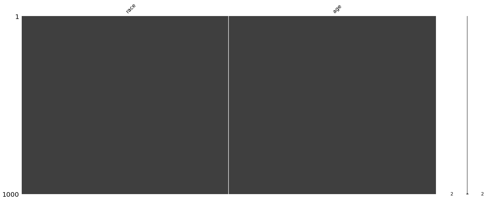
    


```python
msno.matrix(voter_frame)
```


    <matplotlib.axes._subplots.AxesSubplot at 0x7fc625b71150>


    

    


First and foremost, we want to check whether or not we have NaN values in our dataset. In our dataset, there's no NaN values.


```python
voter_frame2.groupby('race')['age'].describe()
```


<div>
<style scoped>
    .dataframe tbody tr th:only-of-type {
        vertical-align: middle;
    }

    .dataframe tbody tr th {
        vertical-align: top;
    }

    .dataframe thead th {
        text-align: right;
    }
</style>
<table border="1" class="dataframe">
  <thead>
    <tr style="text-align: right;">
      <th></th>
      <th>count</th>
      <th>mean</th>
      <th>std</th>
      <th>min</th>
      <th>25%</th>
      <th>50%</th>
      <th>75%</th>
      <th>max</th>
    </tr>
    <tr>
      <th>race</th>
      <th></th>
      <th></th>
      <th></th>
      <th></th>
      <th></th>
      <th></th>
      <th></th>
      <th></th>
    </tr>
  </thead>
  <tbody>
    <tr>
      <th>asian</th>
      <td>44.0</td>
      <td>48.886364</td>
      <td>5.503554</td>
      <td>37.0</td>
      <td>44.0</td>
      <td>49.5</td>
      <td>54.00</td>
      <td>59.0</td>
    </tr>
    <tr>
      <th>black</th>
      <td>147.0</td>
      <td>47.551020</td>
      <td>5.209559</td>
      <td>34.0</td>
      <td>44.0</td>
      <td>47.0</td>
      <td>51.00</td>
      <td>61.0</td>
    </tr>
    <tr>
      <th>hispanic</th>
      <td>244.0</td>
      <td>48.127049</td>
      <td>5.885415</td>
      <td>35.0</td>
      <td>44.0</td>
      <td>48.0</td>
      <td>52.00</td>
      <td>66.0</td>
    </tr>
    <tr>
      <th>other</th>
      <td>50.0</td>
      <td>48.860000</td>
      <td>5.166651</td>
      <td>37.0</td>
      <td>45.0</td>
      <td>48.0</td>
      <td>51.75</td>
      <td>61.0</td>
    </tr>
    <tr>
      <th>white</th>
      <td>515.0</td>
      <td>47.467961</td>
      <td>5.021011</td>
      <td>35.0</td>
      <td>44.0</td>
      <td>47.0</td>
      <td>51.00</td>
      <td>62.0</td>
    </tr>
  </tbody>
</table>
</div>


```python
voter_frame.groupby('race')['age'].describe()
```


<div>
<style scoped>
    .dataframe tbody tr th:only-of-type {
        vertical-align: middle;
    }

    .dataframe tbody tr th {
        vertical-align: top;
    }

    .dataframe thead th {
        text-align: right;
    }
</style>
<table border="1" class="dataframe">
  <thead>
    <tr style="text-align: right;">
      <th></th>
      <th>count</th>
      <th>mean</th>
      <th>std</th>
      <th>min</th>
      <th>25%</th>
      <th>50%</th>
      <th>75%</th>
      <th>max</th>
    </tr>
    <tr>
      <th>race</th>
      <th></th>
      <th></th>
      <th></th>
      <th></th>
      <th></th>
      <th></th>
      <th></th>
      <th></th>
    </tr>
  </thead>
  <tbody>
    <tr>
      <th>asian</th>
      <td>44.0</td>
      <td>48.204545</td>
      <td>4.925395</td>
      <td>39.0</td>
      <td>45.0</td>
      <td>47.0</td>
      <td>51.0</td>
      <td>59.0</td>
    </tr>
    <tr>
      <th>black</th>
      <td>147.0</td>
      <td>47.401361</td>
      <td>5.750116</td>
      <td>35.0</td>
      <td>43.0</td>
      <td>47.0</td>
      <td>51.0</td>
      <td>67.0</td>
    </tr>
    <tr>
      <th>hispanic</th>
      <td>244.0</td>
      <td>48.618852</td>
      <td>6.100514</td>
      <td>32.0</td>
      <td>45.0</td>
      <td>48.0</td>
      <td>53.0</td>
      <td>72.0</td>
    </tr>
    <tr>
      <th>other</th>
      <td>50.0</td>
      <td>47.140000</td>
      <td>5.532870</td>
      <td>29.0</td>
      <td>44.0</td>
      <td>48.0</td>
      <td>50.0</td>
      <td>59.0</td>
    </tr>
    <tr>
      <th>white</th>
      <td>515.0</td>
      <td>50.159223</td>
      <td>5.404088</td>
      <td>36.0</td>
      <td>47.0</td>
      <td>50.0</td>
      <td>54.0</td>
      <td>69.0</td>
    </tr>
  </tbody>
</table>
</div>


Note that white group mean is a little higher than other groups in voter_frame dataset whereas the mean age is the same across groups in voter_frame2.


```python
df2 = voter_frame2.groupby('race')['age'].describe()[['count']].sort_values('count')

df2.plot(kind = 'bar')
plt.xlabel("Race")
plt.ylabel("Number of voters")
plt.title("Number of voters by Race")
plt.show()
```


    
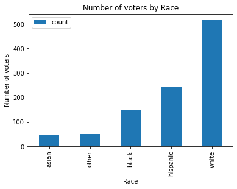
    


```python
df = voter_frame.groupby('race')['age'].describe()[['count']].sort_values('count')
# voter_frame2.groupby('race')['age'].describe()[['count','mean']].sort_values('count')

df.plot(kind = 'bar')
plt.xlabel("Race")
plt.ylabel("Number of voters")
plt.title("Number of voters by Race")
plt.show()
```


    

    


This is a bar plot showing the number of samples assigned for each voter group. Since we didn't change the proportion of sampling for each group, the number of voters are equivalent for both voter_frame and voter_frame2.


```python
plt.figure(figsize=(18, 5))
sns.histplot(voter_frame2['age'], kde= True, stat = "density", linewidth = 0)
plt.title("Distribution of Age")
# plt.xticks(range(0, 100))
plt.box(False)
plt.show()
```


    
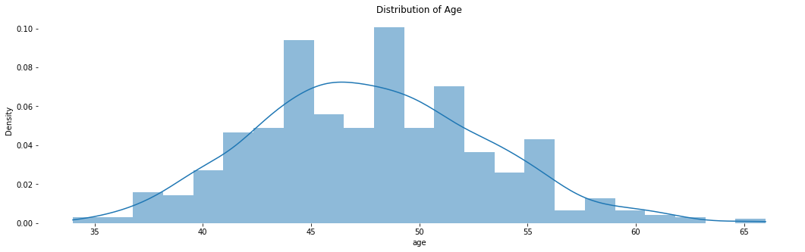
    


```python
# Distribution of age
plt.figure(figsize=(18, 5))
sns.histplot(voter_frame['age'], kde= True, stat = "density", linewidth = 0)
plt.title("Distribution of Age")
# plt.xticks(range(0, 100))
plt.box(False)
plt.show()
```


    
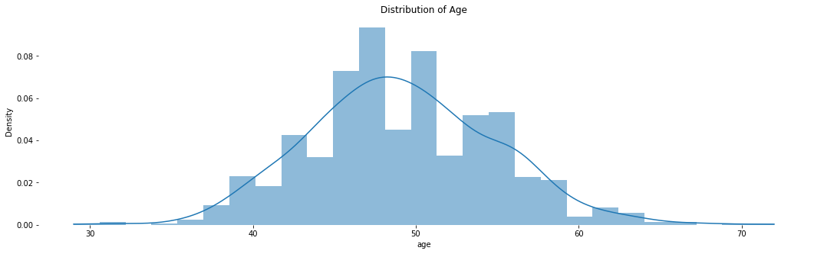
    


These are distribution plots of age for all values of voter_frame. According to the central limit theorem, the more sample we collect from the population, the distribution plot looks more normally distrubted. In this example, however, we simply selected 1000 random samples of which 50% are from white groups and the other 50% from the rest of the groups. Note that there is a light bump around age = 55 in the voter_frame distribution, which may be due to the difference in the average age of a certain group in the data.


```python
# Distribution of age by race
x1 = voter_frame.loc[voter_frame.race=='asian', 'age']
x2 = voter_frame.loc[voter_frame.race=='black', 'age']
x3 = voter_frame.loc[voter_frame.race=='white', 'age']
x4 = voter_frame.loc[voter_frame.race=='hispanic', 'age']
x5 = voter_frame.loc[voter_frame.race=='other', 'age']

kwargs = dict(alpha=0.5, bins=100)

plt.hist(x1, **kwargs, color='g', label='Asian')
plt.hist(x2, **kwargs, color='b', label='Black')
plt.hist(x3, **kwargs, color='r', label='White')
plt.hist(x4, **kwargs, color='orange', label='Hispanic')
plt.hist(x5, **kwargs, color='skyblue', label='Other')
plt.gca().set(title='Frequency Histogram of Diamond Depths', ylabel='Frequency')
plt.xlim(0, 100)
plt.legend();
```


    
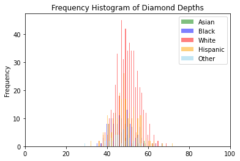
    


In the voter_frame frequency histogram above, frequencies of ages of different groups are plotted in different colors. However, it's very difficult to compare differences among groups. Let's draw a box and whisker plot for a better comparison.


```python
# Box and whisker plot on each race
voter_frame2.boxplot(by ='race', column =['age'], grid = False)
```

    /usr/local/lib/python3.7/dist-packages/numpy/core/_asarray.py:83: VisibleDeprecationWarning: Creating an ndarray from ragged nested sequences (which is a list-or-tuple of lists-or-tuples-or ndarrays with different lengths or shapes) is deprecated. If you meant to do this, you must specify 'dtype=object' when creating the ndarray
      return array(a, dtype, copy=False, order=order)
    


    <matplotlib.axes._subplots.AxesSubplot at 0x7fc625bbfa90>


    
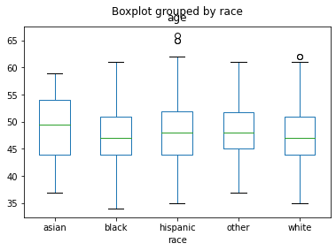
    


```python
voter_frame.boxplot(by ='race', column =['age'], grid = False)
```


    <matplotlib.axes._subplots.AxesSubplot at 0x7f2c631e3ad0>


    
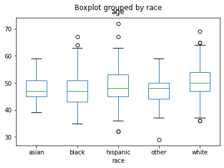
    


Much better! We clearly see the five number summaries of each group for both voter_frame2 and voter_frame. However, it's difficult to tell with eyes if the difference really exists among groups, and if so, between which groups the difference exists.


```python
sns.violinplot(x="race", y="age", data=voter_frame2)
```


    <matplotlib.axes._subplots.AxesSubplot at 0x7fedb865fed0>


    
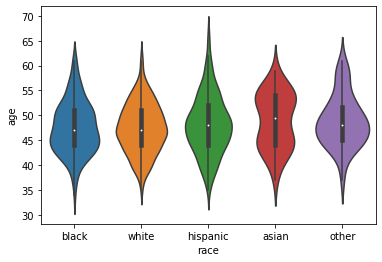
    


```python
sns.violinplot(x="race", y="age", data=voter_frame)
```


    <matplotlib.axes._subplots.AxesSubplot at 0x7f2c63280a90>


    
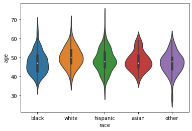
    


We can also draw violin plots which show distribution of the ages for each group for both voter_frame2 and voter_frame.

# Model

Before diving into the models, we have to make sure the assumptions are satisfied. Below is a list of assumptions that apply to the models we are going to test:

- Normality: Each sample is taken from a normally distributed population (Based on the normal distribution plot in the EDA section, normality assumption is met.)
- Sample independence: Each sample has been drawn independely of the other samples (We randomly assigned age and values for our dataset; therefore, sample independence assumption is met.)
- Equal Variance: The variance of data in the different groups should be the same
- Continuous Dependent varialbe: The dependent variable, which in our case is age, should be continuous.


Let's carry out a Shapiro test to verify that our equal variance assumption is satisfied.


```python
import statsmodels.api as sm
from statsmodels.formula.api import ols
import scipy.stats as stats

# Ordinary Least Squares (OLS) model for voter_frame2
model2 = ols('age ~ race', data= voter_frame2).fit()

# Shapiro
w, pvalue = stats.shapiro(model2.resid)
print(w, pvalue)
```

    0.9947804808616638 0.0015859892591834068
    


```python
# Ordinary Least Squares (OLS) model for voter_frame
model = ols('age ~ race', data= voter_frame).fit()

# Shapiro
w, pvalue = stats.shapiro(model.resid)
print(w, pvalue)
```

    0.9947212934494019 0.0014483619015663862
    

The p-values for both voter_frame2 and voter_frame are less than our predetermined significance level of 0.05; therefore, we can confidently say that the equal variance assumption is satisfied.

### One-way ANOVA with F-test


```python
# voter_frame2
stats.f_oneway(asian2, black2, hispanic2, other2, white2)
```


    F_onewayResult(statistic=1.7744689357329695, pvalue=0.13173183201930463)


Since we assigned 48 as the mean of function for every group, One-way ANOVA with F test demonstrates that there is no difference in the average age of votes across groups with a p-value at 0.131 which is greater than our significance level of 0.05. Therefore, we fail to reject the null hypothesis that there is no difference in means across different groups.


```python
# voter_frame
stats.f_oneway(asian, black, hispanic, other, white)
```


    F_onewayResult(statistic=10.164699828386366, pvalue=4.5613242113994585e-08)


Since we assigned 48 as the mean of function for every group besides the white group whose mean of function value is 50, One-way ANOVA with F test demonstrates that there is a difference in means among groups with a p-value less than our significance level of 0.05. Therefore, we can confidently reject the null hypothesis and argue that there is a difference between groups in voter_frame2 dataframe. However, since it's a one way test, we can't say between which groups the difference exists.

### T-test with Bonferroni correction


```python
race_pairs = []

for race1 in range(4):
    for race2  in range(race1+1,5):
        race_pairs.append((races[race1], races[race2]))

# Conduct t-test on each pair
for race1, race2 in race_pairs: 
    print(race1, race2)
    print(stats.ttest_ind(voter_age2[groups[race1]], 
                          voter_age2[groups[race2]])) 
```

    asian black
    Ttest_indResult(statistic=1.4723166654510063, pvalue=0.14259864916065687)
    asian hispanic
    Ttest_indResult(statistic=0.7952576949464497, pvalue=0.42712310624411387)
    asian other
    Ttest_indResult(statistic=0.023943564194904926, pvalue=0.9809494819541007)
    asian white
    Ttest_indResult(statistic=1.7847665455760953, pvalue=0.07484331440702094)
    black hispanic
    Ttest_indResult(statistic=-0.9779887872139286, pvalue=0.328687679434698)
    black other
    Ttest_indResult(statistic=-1.537940275215305, pvalue=0.12568427083007871)
    black white
    Ttest_indResult(statistic=0.1754225782292794, pvalue=0.860801405242227)
    hispanic other
    Ttest_indResult(statistic=-0.8181367221979297, pvalue=0.41394624196541574)
    hispanic white
    Ttest_indResult(statistic=1.5959271355589721, pvalue=0.11092241932285327)
    other white
    Ttest_indResult(statistic=1.866874647450789, pvalue=0.06243863321791571)
    

Using T-test with Bonferroni correction, we can now evaluate between which two groups the difference exists. Since we have 5 groups, we do a total of 10 comparisons and assess whether or not p-value is lower than the significance level at 0.05 for each comparison. As you may already have inferred from the result in One-way Anova with F-test for voter_frame2, there is no difference between any groups.


```python
# T-test with Bonferroni correction

# Get all race pairs
race_pairs = []

for race1 in range(4):
    for race2  in range(race1+1,5):
        race_pairs.append((races[race1], races[race2]))

# Conduct t-test on each pair
for race1, race2 in race_pairs: 
    print(race1, race2)
    print(stats.ttest_ind(voter_age[groups[race1]], 
                          voter_age[groups[race2]])) 
```

    asian black
    Ttest_indResult(statistic=0.838644690974798, pvalue=0.4027281369339345)
    asian hispanic
    Ttest_indResult(statistic=-0.42594691924932293, pvalue=0.6704669004240726)
    asian other
    Ttest_indResult(statistic=0.9795284739636, pvalue=0.3298877500095151)
    asian white
    Ttest_indResult(statistic=-2.318108811252288, pvalue=0.020804701566400217)
    black hispanic
    Ttest_indResult(statistic=-1.9527839210712925, pvalue=0.05156197171952594)
    black other
    Ttest_indResult(statistic=0.28025754367057176, pvalue=0.7795770111117659)
    black white
    Ttest_indResult(statistic=-5.379303881281835, pvalue=1.039421216662395e-07)
    hispanic other
    Ttest_indResult(statistic=1.5853626170340225, pvalue=0.11396630528484335)
    hispanic white
    Ttest_indResult(statistic=-3.5160312714115376, pvalue=0.0004641298649066684)
    other white
    Ttest_indResult(statistic=-3.763809322077872, pvalue=0.00018490576317593065)
    

We have already claimed that there is at least one group means difference in voter_frame dataset. Here, we are now able to assess between which 2 groups the difference exists. Given the significance level at 0.05, (asian white), (black white), (hispanic white), (other white) are the groups where there's a difference in mean value. This is because it manually set the mean value to be different for the white group when we were creating the voter_frame dataset.

### Tukey's Test


```python
# Tukey test for voter_frame2

from statsmodels.stats.multicomp import pairwise_tukeyhsd
tukey2 = pairwise_tukeyhsd(endog=voter_age2,     # Data
                          groups=voter_race2,   # Groups
                          alpha=0.05)          # Significance level

tukey2.plot_simultaneous()    # Plot group confidence intervals
plt.vlines(x=49.57,ymin=-0.5,ymax=4.5, color="red")

tukey2.summary()              # See test summary
```


<table class="simpletable">
<caption>Multiple Comparison of Means - Tukey HSD, FWER=0.05</caption>
<tr>
   <th>group1</th>   <th>group2</th>  <th>meandiff</th>  <th>p-adj</th>  <th>lower</th>   <th>upper</th> <th>reject</th>
</tr>
<tr>
    <td>asian</td>    <td>black</td>   <td>-1.3353</td> <td>0.5735</td> <td>-3.8242</td> <td>1.1535</td>  <td>False</td>
</tr>
<tr>
    <td>asian</td>  <td>hispanic</td>  <td>-0.7593</td>   <td>0.9</td>  <td>-3.1315</td> <td>1.6129</td>  <td>False</td>
</tr>
<tr>
    <td>asian</td>    <td>other</td>   <td>-0.0264</td>   <td>0.9</td>  <td>-3.0202</td> <td>2.9674</td>  <td>False</td>
</tr>
<tr>
    <td>asian</td>    <td>white</td>   <td>-1.4184</td> <td>0.4336</td> <td>-3.6932</td> <td>0.8564</td>  <td>False</td>
</tr>
<tr>
    <td>black</td>  <td>hispanic</td>   <td>0.576</td>  <td>0.8145</td> <td>-0.9362</td> <td>2.0882</td>  <td>False</td>
</tr>
<tr>
    <td>black</td>    <td>other</td>    <td>1.309</td>  <td>0.5494</td> <td>-1.0622</td> <td>3.6801</td>  <td>False</td>
</tr>
<tr>
    <td>black</td>    <td>white</td>   <td>-0.0831</td>   <td>0.9</td>  <td>-1.4374</td> <td>1.2713</td>  <td>False</td>
</tr>
<tr>
  <td>hispanic</td>   <td>other</td>    <td>0.733</td>  <td>0.8996</td> <td>-1.5154</td> <td>2.9813</td>  <td>False</td>
</tr>
<tr>
  <td>hispanic</td>   <td>white</td>   <td>-0.6591</td> <td>0.4974</td> <td>-1.7847</td> <td>0.4665</td>  <td>False</td>
</tr>
<tr>
    <td>other</td>    <td>white</td>   <td>-1.392</td>  <td>0.3912</td> <td>-3.5374</td> <td>0.7533</td>  <td>False</td>
</tr>
</table>


    
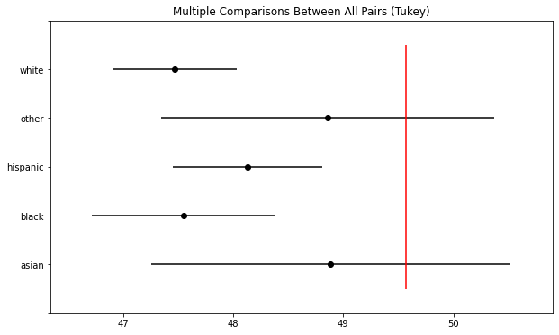
    


Tukey's test is another way of evaluating between which two groups the difference exists. Just as we've seen in previous models (One-way ANOVA with F-test and t-test with Bonferroni correction) for voter_frame2, so does the Tukey's test for voter_frame2 not show any differences in mean value for any pairs of groups.

The 95% confidence interval plot visually shows that every grou's confidence interval overlaps with each other at at least one point in age. In other words, there is no statistically significant difference in means among any groups.  Please note that the pairs with upper and lower bounds (confidence interval) that include 0 are the pairs with p-values greater than 0.05.


```python
# Tukey's test for voter_frame

tukey = pairwise_tukeyhsd(endog=voter_age,     # Data
                          groups=voter_race,   # Groups
                          alpha=0.05)          # Significance level

tukey.plot_simultaneous()    # Plot group confidence intervals
plt.vlines(x=49.57,ymin=-0.5,ymax=4.5, color="red")

tukey.summary()              # See test summary
```


<table class="simpletable">
<caption>Multiple Comparison of Means - Tukey HSD, FWER=0.05</caption>
<tr>
   <th>group1</th>   <th>group2</th>  <th>meandiff</th>  <th>p-adj</th>  <th>lower</th>   <th>upper</th> <th>reject</th>
</tr>
<tr>
    <td>asian</td>    <td>black</td>   <td>-0.8032</td>   <td>0.9</td>  <td>-3.4423</td>  <td>1.836</td>  <td>False</td>
</tr>
<tr>
    <td>asian</td>  <td>hispanic</td>  <td>0.4143</td>    <td>0.9</td>  <td>-2.1011</td> <td>2.9297</td>  <td>False</td>
</tr>
<tr>
    <td>asian</td>    <td>other</td>   <td>-1.0645</td> <td>0.8852</td> <td>-4.2391</td>  <td>2.11</td>   <td>False</td>
</tr>
<tr>
    <td>asian</td>    <td>white</td>   <td>1.9547</td>   <td>0.175</td> <td>-0.4575</td> <td>4.3668</td>  <td>False</td>
</tr>
<tr>
    <td>black</td>  <td>hispanic</td>  <td>1.2175</td>  <td>0.2318</td> <td>-0.386</td>   <td>2.821</td>  <td>False</td>
</tr>
<tr>
    <td>black</td>    <td>other</td>   <td>-0.2614</td>   <td>0.9</td>  <td>-2.7757</td>  <td>2.253</td>  <td>False</td>
</tr>
<tr>
    <td>black</td>    <td>white</td>   <td>2.7579</td>   <td>0.001</td> <td>1.3217</td>   <td>4.194</td>  <td>True</td> 
</tr>
<tr>
  <td>hispanic</td>   <td>other</td>   <td>-1.4789</td> <td>0.4391</td> <td>-3.863</td>  <td>0.9053</td>  <td>False</td>
</tr>
<tr>
  <td>hispanic</td>   <td>white</td>   <td>1.5404</td>   <td>0.004</td> <td>0.3468</td>   <td>2.734</td>  <td>True</td> 
</tr>
<tr>
    <td>other</td>    <td>white</td>   <td>3.0192</td>  <td>0.0028</td> <td>0.7443</td>  <td>5.2941</td>  <td>True</td> 
</tr>
</table>


    
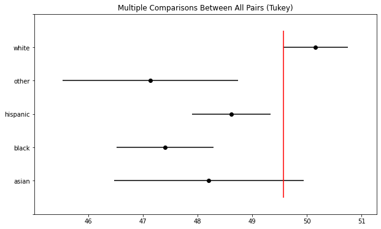
    


Unlike the Tukey's test done above, the tukey's test for voter_form dataset shows that 3 pairs of groups (White ~ Black), (White ~ Hispanic), (White ~ Other) have different means of age that are statistically significant which allow us to reject the null hypothesis. Compared to the result from T-test with Bonferroni correction, tukey's test tends to be more conservative and therefore shows that there are only 3 pairs of groups whose difference in mean value is statistically significant.

The 95% confidence interval plot visually shows that only the asian group's confidence interval overlaps with the white group's CI. In other words, there is no significant difference in means between white group and asian group. For all the other groups besides asian group, there exists a statiscally significant difference in the average age of voters when compared with the white group. Please note that the pairs with upper and lower bounds (confidence interval) that don’t include 0 are the pairs with p-values lower than 0.05.

# Conclusion

- Finally explain what we concluded from this ANOVA analysis about the average age of voters across groups in the data
- Did we solve the problem we set out to solve?


As for voter_frame dataset, since we assigned 30 as the mean of function for every group besides the white group whose mean of function value was 32, One-way ANOVA with F test demonstrated that there is a difference in average age of voter across groups with p-values less than our significance level of 0.05. Therefore, we had a solid evidence to reject the null hypothesis and argue that there is a difference among groups in voter_frame2 dataframe. However, since it's a one-way ANOVA test, we could't say between which groups the difference exists. Through T-test with Bonferroni correction and Tukey's test, we were able to find that 4 pairs of groups (asian white), (black white), (hispanic white), (other white) and 3 pairs of groups (White ~ Black), (White ~ Hispanic), (White ~ Other) have different means of age respectively. The difference in pairs of groups was due to the model's degree of conservativeness.


Through this exercise, we were able to explore various models, such as One-way ANOVA with F-test, T-test with Bonferroni correction, and Tukey's Test, to find the existence of group difference or between which specific groups the difference exists. Based on these findings of between which groups the average age of voters exists, we can carry out a more in-depth research as to why the difference in age exists across race groups and respond accordingly.

All in all, it was a good experience to learn and try out important statistical concepts with synthetic data! I would love to explore more post-hoc tests like FIsher's HSD in the future.

